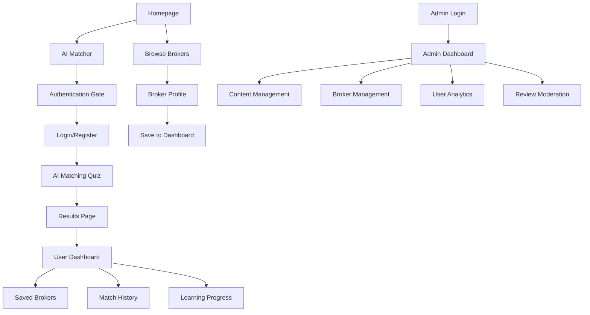

# Dualite Platform - Comprehensive Feature Enhancement Requirements

## 1. Product Overview

Dualite is a comprehensive forex broker review and comparison platform that helps traders find the most suitable brokers based on their trading needs and preferences. The platform combines AI-powered matching, detailed broker analysis, educational resources, and user-generated reviews to create a trusted marketplace for forex trading decisions.

The platform addresses the critical problem of broker selection complexity in the forex market, serving both novice and experienced traders who need reliable, data-driven insights to make informed decisions. With over 50 major forex brokers to analyze and compare, Dualite aims to become the leading authority in forex broker evaluation and recommendation.

## 2. Core Features

### 2.1 User Roles

| Role            | Registration Method                   | Core Permissions                                                                    |
| --------------- | ------------------------------------- | ----------------------------------------------------------------------------------- |
| Guest User      | No registration required              | Browse brokers, view basic information, access limited content                      |
| Registered User | Email registration with Supabase Auth | Full AI matcher access, save broker preferences, write reviews, access learning hub |
| Admin User      | Invitation-based upgrade              | Full content management, broker data management, user moderation, analytics access  |

### 2.2 Feature Module

Our comprehensive platform enhancement consists of the following main pages:

1. **Enhanced Admin Dashboard**: Content management system, broker data management, user analytics, review moderation
2. **Responsive Interface Optimization**: Mobile-first design, touch interactions, cross-device compatibility
3. **AI Matcher with Authentication Gate**: Mandatory login, personalized recommendations, results dashboard
4. **User Dashboard**: Saved brokers, AI match history, learning progress, account settings
5. **Broker Profile Pages**: Detailed reviews for top 50 brokers, consistent template structure, SEO optimization
6. **Modern UX Elements**: Infinite scroll, hover previews, Apple TV-inspired design, TikTok-style interactions

### 2.3 Page Details

| Page Name            | Module Name         | Feature description                                                                                                                            |
| -------------------- | ------------------- | ---------------------------------------------------------------------------------------------------------------------------------------------- |
| Admin Dashboard      | Content Management  | Upload, edit, delete media and text content. Secure file handling with Supabase Storage integration. Bulk operations and content organization. |
| Admin Dashboard      | Broker Management   | Add, edit, remove broker profiles. Update trading conditions, ratings, and regulatory information. Import/export broker data.                  |
| Admin Dashboard      | User Analytics      | View user engagement metrics, AI matcher usage statistics, review analytics. Export reports and track platform growth.                         |
| Admin Dashboard      | Review Moderation   | Approve, reject, or flag user reviews. Manage verified reviews and handle spam detection.                                                      |
| Responsive Interface | Mobile Optimization | Touch-friendly navigation, optimized layouts for mobile devices, gesture support for swipe actions.                                            |
| Responsive Interface | Cross-Device Sync   | Consistent user experience across desktop, tablet, and mobile. Responsive breakpoints and adaptive components.                                 |
| AI Matcher           | Authentication Gate | Mandatory user login before accessing AI matching features. Redirect to registration/login flow.                                               |
| AI Matcher           | Enhanced Algorithm  | Improved scoring system based on user preferences, trading style, and risk tolerance. Machine learning recommendations.                        |
| AI Matcher           | Results Dashboard   | Detailed match explanations, broker comparison tools, save and share functionality.                                                            |
| User Dashboard       | Saved Brokers       | Personal broker shortlist, comparison tools, notes and ratings. Remove and organize saved brokers.                                             |
| User Dashboard       | Match History       | Previous AI matcher results, re-run analysis, track preference changes over time.                                                              |
| User Dashboard       | Learning Progress   | Track completed modules, quiz scores, achievement badges, personalized learning paths.                                                         |
| Broker Profiles      | Top 50 Brokers      | Research and create dedicated pages for leading forex brokers. Consistent structure following Pepperstone template.                            |
| Broker Profiles      | SEO Optimization    | Meta tags, structured data, internal linking, URL optimization for search engine visibility.                                                   |
| Broker Profiles      | Cross-Linking       | Related broker suggestions, comparison tools, category-based navigation between broker pages.                                                  |
| Modern UX            | Infinite Scroll     | Seamless content loading for broker lists, reviews, and search results. Performance optimization and loading states.                           |
| Modern UX            | Hover Previews      | Quick broker information on hover, preview cards for detailed information without navigation.                                                  |
| Modern UX            | Apple TV Design     | Premium visual aesthetics, smooth animations, card-based layouts, elegant typography.                                                          |
| Modern UX            | TikTok Interactions | Fast, engaging user interactions, swipe gestures, quick actions, micro-animations.                                                             |

## 3. Core Process

### Guest User Flow

1. User visits homepage → Browse featured brokers → View basic broker information → Prompted to register for full features
2. User attempts AI matcher → Redirected to authentication → Complete registration → Access full AI matching

### Registered User Flow

1. User logs in → Access dashboard → View saved brokers and match history → Use AI matcher → Save results to dashboard
2. User browses brokers → Use hover previews → View detailed broker profiles → Save to personal list → Compare brokers
3. User accesses learning hub → Complete modules → Track progress on dashboard → Earn achievements

### Admin User Flow

1. Admin logs in → Access admin dashboard → Manage broker content → Upload media → Moderate reviews → View analytics
2. Admin adds new broker → Research broker information → Create profile page → Optimize for SEO → Publish and cross-link

## 4. User Interface Design

### 4.1 Design Style

* **Primary Colors**: Deep navy (#1a202c) and premium gold (#f6ad55) for trust and sophistication

* **Secondary Colors**: Clean whites (#ffffff) and subtle grays (#f7fafc, #edf2f7) for readability

* **Button Style**: Rounded corners (8px), subtle shadows, hover animations with color transitions

* **Typography**: Inter font family, 16px base size, clear hierarchy with 24px/32px/48px headings

* **Layout Style**: Card-based design with generous white space, Apple TV-inspired depth and shadows

* **Icons**: Lucide React icons with consistent 20px/24px sizing, subtle animations on interaction

* **Animations**: Smooth 300ms transitions, fade-in effects, micro-interactions for engagement

### 4.2 Page Design Overview

| Page Name       | Module Name         | UI Elements                                                                                                      |
| --------------- | ------------------- | ---------------------------------------------------------------------------------------------------------------- |
| Admin Dashboard | Content Management  | Drag-and-drop file upload areas, tabbed interface, data tables with sorting/filtering, modal dialogs for editing |
| Admin Dashboard | Analytics           | Chart.js visualizations, metric cards with trend indicators, date range selectors, export buttons                |
| AI Matcher      | Authentication Gate | Centered modal overlay, social login options, form validation with real-time feedback                            |
| AI Matcher      | Quiz Interface      | Progress indicator, card-based questions, smooth transitions between steps, visual preference selectors          |
| AI Matcher      | Results Display     | Broker cards with match percentages, detailed comparison tables, save/share action buttons                       |
| User Dashboard  | Overview            | Widget-based layout, quick stats cards, recent activity feed, navigation sidebar                                 |
| User Dashboard  | Saved Brokers       | Grid layout with broker cards, comparison checkboxes, sorting/filtering options                                  |
| Broker Profiles | Header Section      | Hero image, broker logo, trust score badge, key metrics display, CTA buttons                                     |
| Broker Profiles | Content Tabs        | Trading conditions, features, reviews, education - tabbed navigation with smooth transitions                     |
| Modern UX       | Infinite Scroll     | Skeleton loading states, smooth content insertion, scroll position memory                                        |
| Modern UX       | Hover Previews      | Floating cards with broker summary, delayed appearance (300ms), smooth fade animations                           |

### 4.3 Responsiveness

The platform follows a mobile-first approach with progressive enhancement for larger screens:

* \*\*Mobile (320px-

