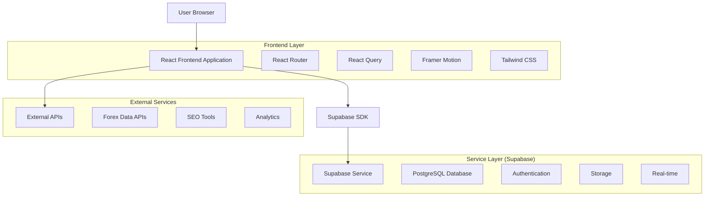
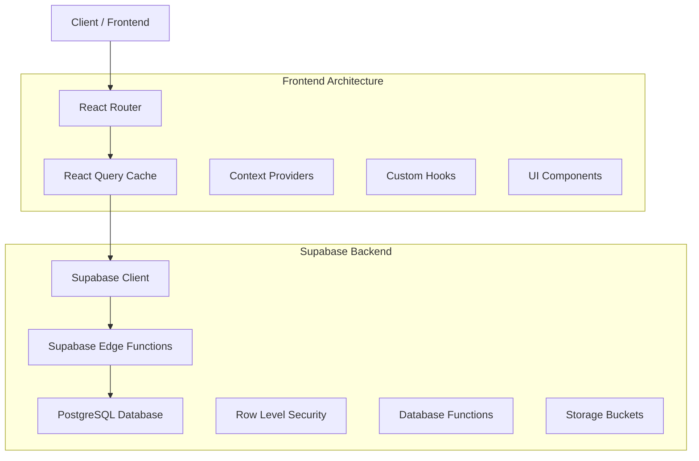
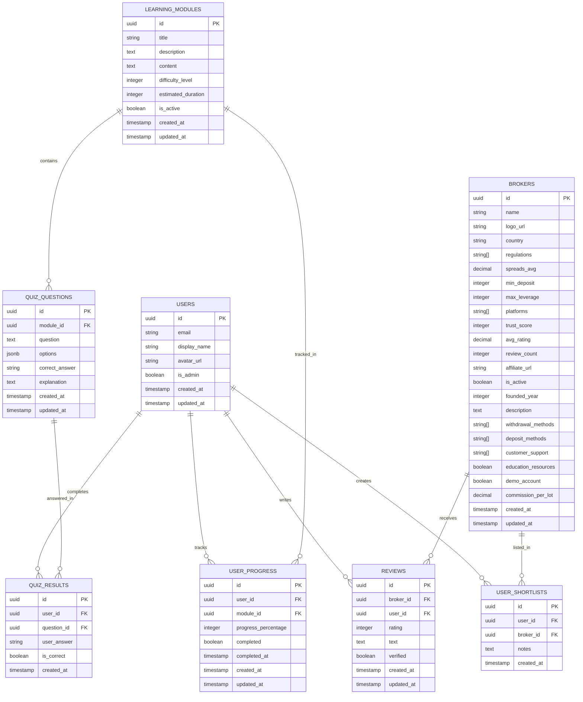

# Dualite Platform - Technical Architecture Document

## 1. Architecture Design



## 2. Technology Description

* **Frontend**: React\@19 + TypeScript + Tailwind CSS\@3 + Vite

* **Backend**: Supabase (PostgreSQL, Auth, Storage, Real-time)

* **UI Components**: Radix UI + Shadcn/ui + Lucide React

* **State Management**: React Query\@5 + React Context

* **Routing**: React Router DOM\@6

* **Animations**: Framer Motion\@12

* **Forms**: React Hook Form + Zod validation

* **Charts**: Recharts\@2 for analytics

## 3. Route Definitions

| Route       | Purpose                                             |
| ----------- | --------------------------------------------------- |
| /           | Homepage with hero section and featured brokers     |
| /brokers    | Browse all brokers with filtering and search        |
| /broker/:id | Individual broker profile pages                     |
| /ai-matcher | AI-powered broker matching with auth gate           |
| /dashboard  | User dashboard with saved brokers and match history |
| /admin      | Admin dashboard for content and broker management   |
| /learning   | Educational hub with modules and quizzes            |
| /reviews    | User reviews and ratings for brokers                |
| /login      | Authentication page                                 |
| /register   | User registration page                              |
| /profile    | User profile and settings                           |

## 4. API Definitions

### 4.1 Core API Endpoints (Supabase)

**Authentication**

```typescript
// Supabase Auth methods
supabase.auth.signUp({ email, password })
supabase.auth.signInWithPassword({ email, password })
supabase.auth.signOut()
supabase.auth.getUser()
```

**Broker Management**

```typescript
// Get all active brokers
GET /rest/v1/brokers?is_active=eq.true

// Get broker by ID
GET /rest/v1/brokers?id=eq.{broker_id}

// Update broker (Admin only)
PATCH /rest/v1/brokers?id=eq.{broker_id}
```

**User Data**

```typescript
// Get user shortlist
GET /rest/v1/user_shortlists?user_id=eq.{user_id}

// Add broker to shortlist
POST /rest/v1/user_shortlists
Body: { user_id, broker_id }

// Get user progress
GET /rest/v1/user_progress?user_id=eq.{user_id}
```

**Reviews**

```typescript
// Get broker reviews
GET /rest/v1/reviews?broker_id=eq.{broker_id}&select=*,users(display_name,avatar_url)

// Create review
POST /rest/v1/reviews
Body: { broker_id, user_id, rating, text }
```

### 4.2 External API Integration

**Forex Data API**

```typescript
interface ForexDataResponse {
  broker_name: string;
  spreads: number;
  regulations: string[];
  last_updated: string;
}
```

**SEO Analysis API**

```typescript
interface SEOMetrics {
  page_url: string;
  meta_title: string;
  meta_description: string;
  keywords: string[];
  performance_score: number;
}
```

## 5. Server Architecture Diagram



## 6. Data Model

### 6.1 Data Model Definition



### 6.2 Data Definition Language

**Enhanced Broker Table (Additional columns for new features)**

```sql
-- Add new columns to existing brokers table
ALTER TABLE brokers ADD COLUMN IF NOT EXISTS seo_title VARCHAR(255);
ALTER TABLE brokers ADD COLUMN IF NOT EXISTS seo_description TEXT;
ALTER TABLE brokers ADD COLUMN IF NOT EXISTS seo_keywords TEXT[];
ALTER TABLE brokers ADD COLUMN IF NOT EXISTS featured_image_url VARCHAR(255);
ALTER TABLE brokers ADD COLUMN IF NOT EXISTS social_media JSONB;
ALTER TABLE brokers ADD COLUMN IF NOT EXISTS trading_instruments TEXT[];
ALTER TABLE brokers ADD COLUMN IF NOT EXISTS account_types JSONB;

-- Create indexes for performance
CREATE INDEX IF NOT EXISTS idx_brokers_seo_keywords ON brokers USING GIN(seo_keywords);
CREATE INDEX IF NOT EXISTS idx_brokers_featured ON brokers(is_active, trust_score DESC) WHERE is_active = true;
CREATE INDEX IF NOT EXISTS idx_brokers_country ON brokers(country) WHERE is_active = true;
```

**Admin Activity Log Table**

```sql
-- Create admin activity tracking
CREATE TABLE admin_activity_log (
    id UUID PRIMARY KEY DEFAULT gen_random_uuid(),
    admin_user_id UUID REFERENCES users(id) ON DELETE CASCADE,
    action_type VARCHAR(50) NOT NULL,
    target_table VARCHAR(50),
    target_id UUID,
    old_values JSONB,
    new_values JSONB,
    ip_address INET,
    user_agent TEXT,
    created_at TIMESTAMP WITH TIME ZONE DEFAULT NOW()
);

-- Create indexes
CREATE INDEX idx_admin_activity_user_id ON admin_activity_log(admin_user_id);
CREATE INDEX idx_admin_activity_created_at ON admin_activity_log(created_at DESC);
CREATE INDEX idx_admin_activity_action_type ON admin_activity_log(action_type);

-- RLS Policy
ALTER TABLE admin_activity_log ENABLE ROW LEVEL SECURITY;
CREATE POLICY "Admin can view all activity logs" ON admin_activity_log
    FOR SELECT USING (auth.jwt() ->> 'email' IN (
        SELECT email FROM users WHERE is_admin = true
    ));
```

**Content Management Table**

```sql
-- Create content management table
CREATE TABLE content_items (
    id UUID PRIMARY KEY DEFAULT gen_random_uuid(),
    title VARCHAR(255) NOT NULL,
    content_type VARCHAR(50) NOT NULL, -- 'article', 'image', 'video', 'document'
    content_data JSONB NOT NULL,
    file_url VARCHAR(255),
    file_size BIGINT,
    mime_type VARCHAR(100),
    tags TEXT[],
    is_published BOOLEAN DEFAULT false,
    published_at TIMESTAMP WITH TIME ZONE,
    created_by UUID REFERENCES users(id) ON DELETE SET NULL,
    updated_by UUID REFERENCES users(id) ON DELETE SET NULL,
    created_at TIMESTAMP WITH TIME ZONE DEFAULT NOW(),
    updated_at TIMESTAMP WITH TIME ZONE DEFAULT NOW()
);

-- Create indexes
CREATE INDEX idx_content_items_type ON content_items(content_type);
CREATE INDEX idx_content_items_published ON content_items(is_published, published_at DESC);
CREATE INDEX idx_content_items_tags ON content_items USING GIN(tags);
CREATE INDEX idx_content_items_created_by ON content_items(created_by);

-- RLS Policies
ALTER TABLE content_items ENABLE ROW LEVEL SECURITY;
CREATE POLICY "Public can view published content" ON content_items
    FOR SELECT USING (is_published = true);
CREATE POLICY "Admin can manage all content" ON content_items
    FOR ALL USING (auth.jwt() ->> 'email' IN (
        SELECT email FROM users WHERE is_admin = true
    ));
```

**AI Matcher Results Table**

```sql
-- Create AI matcher results tracking
CREATE TABLE ai_matcher_results (
    id UUID PRIMARY KEY DEFAULT gen_random_uuid(),
    user_id UUID REFERENCES users(id) ON DELETE CASCADE,
    quiz_responses JSONB NOT NULL,
    matched_brokers JSONB NOT NULL, -- Array of broker IDs with scores
    algorithm_version VARCHAR(20) DEFAULT '1.0',
    created_at TIMESTAMP WITH TIME ZONE DEFAULT NOW()
);

-- Create indexes
CREATE INDEX idx_ai_matcher_user_id ON ai_matcher_results(user_id);
CREATE INDEX idx_ai_matcher_created_at ON ai_matcher_results(created_at DESC);

-- RLS Policy
ALTER TABLE ai_matcher_results ENABLE ROW LEVEL SECURITY;
CREATE POLICY "Users can view own matcher results" ON ai_matcher_results
    FOR SELECT USING (auth.uid() = user_id);
CREATE POLICY "Users can insert own matcher results" ON ai_matcher_results
    FOR INSERT WITH CHECK (auth.uid() = user_id);
```

**Storage Buckets Configuration**

```sql
-- Create storage buckets for file uploads
INSERT INTO storage.buckets (id, name, public) VALUES 
    ('broker-logos', 'broker-logos', true),
    ('content-media', 'content-media', true),
    ('user-avatars', 'user-avatars', true),
    ('admin-uploads', 'admin-uploads', false);

-- Storage policies
CREATE POLICY "Public can view broker logos" ON storage.objects
    FOR SELECT USING (bucket_id = 'broker-logos');

CREATE POLICY "Admin can upload content media" ON storage.objects
    FOR INSERT WITH CHECK (
        bucket_id = 'content-media' AND 
        auth.jwt() ->> 'email' IN (SELECT email FROM users WHERE is_admin = true)
    );

CREATE POLICY "Users can upload avatars" ON storage.objects
    FOR INSERT WITH CHECK (
        bucket_id = 'user-avatars' AND 
        auth.uid()::text = (storage.foldername(name))[1]
    );
```

**Database Functions for Enhanced Features**

```sql
-- Function to update broker SEO metrics
CREATE OR REPLACE FUNCTION update_broker_seo_metrics()
RETURNS TRIGGER AS $$
BEGIN
    -- Auto-generate SEO title if not provided
    IF NEW.seo_title IS NULL OR NEW.seo_title = '' THEN
        NEW.seo_title := NEW.name || ' Review - Detailed Analysis & Rating';
    END IF;
    
    -- Auto-generate SEO description if not provided
    IF NEW.seo_description IS NULL OR NEW.seo_description = '' THEN
        NEW.seo_description := 'Comprehensive review of ' || NEW.name || 
            '. Trust score: ' || NEW.trust_score || '/100. ' ||
            'Min deposit: $' || NEW.min_deposit || '. Read detailed analysis.';
    END IF;
    
    RETURN NEW;
END;
$$ LANGUAGE plpgsql;

-- Create trigger
CREATE TRIGGER broker_seo_update_trigger
    BEFORE INSERT OR UPDATE ON brokers
    FOR EACH ROW
    EXECUTE FUNCTION update_broker_seo_metrics();
```

**Initial Data for Top 50 Brokers**

```sql
-- Sample data for top forex brokers (first 5 as example)
INSERT INTO brokers (
    name, country, regulations, spreads_avg, min_deposit, max_leverage,
    platforms, trust_score, is_active, founded_year, description,
    education_resources, demo_account, seo_keywords
) VALUES 
(
    'Pepperstone', 'Australia', ARRAY['ASIC', 'FCA', 'DFSA'], 0.6, 200, 500,
    ARRAY['MT4', 'MT5', 'cTrader', 'Web'], 92, true, 2010,
    'Award-winning forex broker known for tight spreads and fast execution',
    true, true, ARRAY['pepperstone', 'forex', 'trading', 'australia', 'asic']
),
(
    'IC Markets', 'Australia', ARRAY['ASIC', 'CySEC'], 0.5, 200, 500,
    ARRAY['MT4', 'MT5', 'cTrader'], 90, true, 2007,
    'Leading ECN forex broker with institutional-grade trading conditions',
    true, true, ARRAY['ic markets', 'ecn', 'forex', 'raw spreads']
),
(
    'XM Group', 'Cyprus', ARRAY['CySEC', 'ASIC', 'IFSC'], 1.0, 5, 888,
    ARRAY['MT4', 'MT5', 'Web'], 88, true, 2009,
    'Global forex broker serving millions of clients worldwide',
    true, true, ARRAY['xm', 'forex', 'cyprus', 'global']
),
(
    'OANDA', 'United States', ARRAY['CFTC', 'NFA', 'FCA'], 1.2, 0, 50,
    ARRAY['MT4', 'Web', 'Mobile'], 87, true, 1996,
    'Established forex pioneer with transparent pricing and regulation',
    true, true, ARRAY['oanda', 'usa', 'transparent', 'established']
),
(
    'IG Group', 'United Kingdom', ARRAY['FCA', 'ASIC', 'MAS'], 0.8, 250, 200,
    ARRAY['MT4', 'Web', 'Mobile'], 89, true, 1974,
    'FTSE 250 listed broker with comprehensive trading platform',
    true, true, ARRAY['ig', 'uk', 'ftse', 'comprehensive']
);
```

